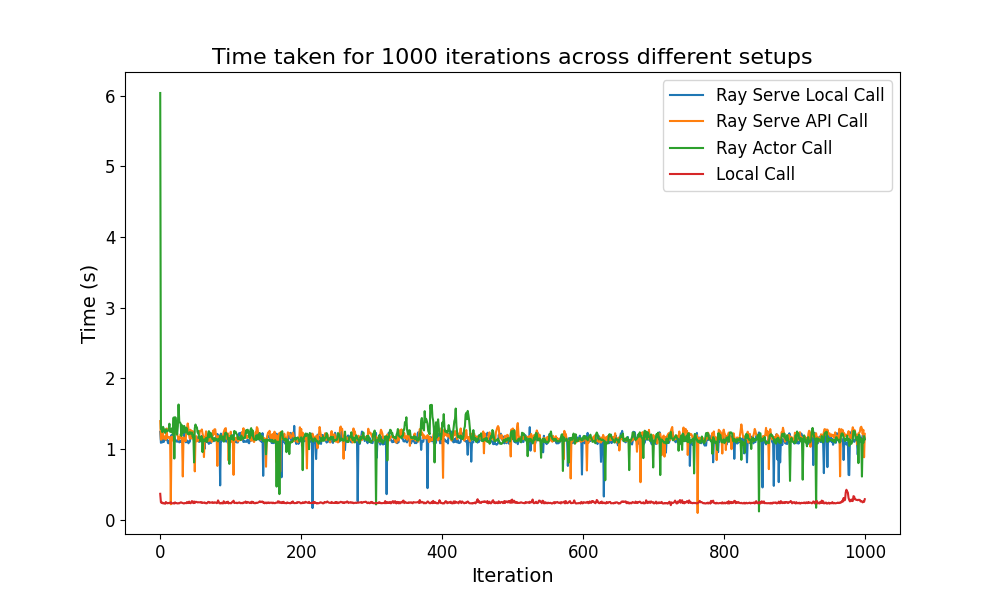

# Benchmarking ray setups for M.Sc. Thesis

This repository is used for benchmarking several different environments and setups. 

## Local Setup:

| **Component** | **Specification** |
|---------------|--------------------|
| CPU           | AMD Ryzen 7 3700X 8-Core Processor, 3.59 GHz |
| RAM           | 48 GB              |
| GPU           | RTX 4060 Ti with 8 GB VRAM |

## Cloud Setup:

The individual deployment types can be seen in their respective folders, but as a baseline we are using Azure Standard_NC4as_T4_v3 GPU Nodes for the Worker nodes and Standard_D2s_v3 for the Head node.

# Benchmark Results - Local:

| **Method**            | **Average Time (s)** | **Standard Deviation (s)** |
|-----------------------|----------------------|----------------------------|
| Ray Serve Local Call  | 1.1196               | 0.0998                     |
| Ray Serve API Call    | 1.1626               | 0.0963                     |
| Ray Actor Call        | 1.1608               | 0.1951                     |
| Local Call            | 0.2460               | 0.0160                     |

